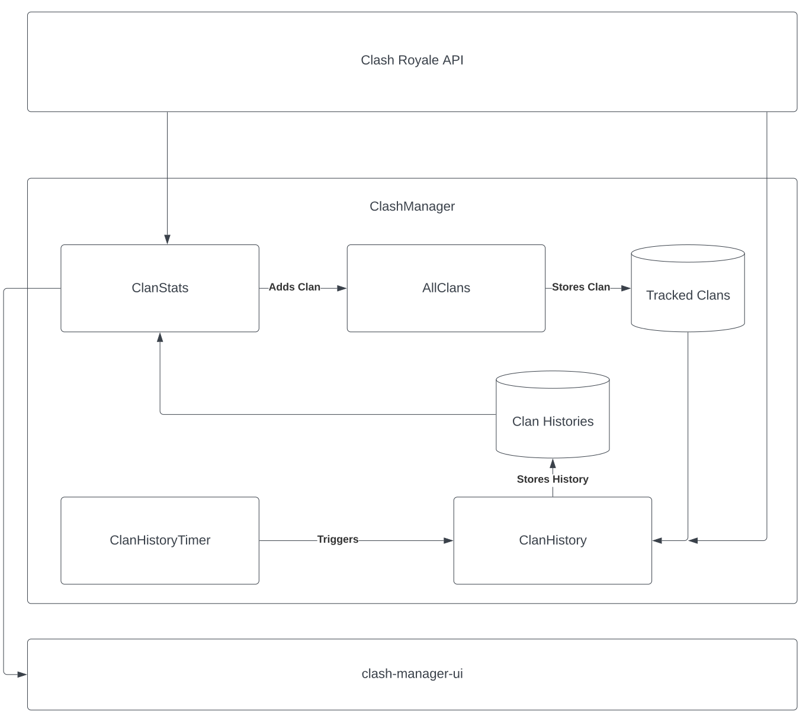

# ClashManager
A set of Azure Functions to collect clan data from the Clash Royale API

## Program Structure



## Running locally on VSCode (recommended)
- Install the following extensions:
    - Azure Functions
    - Azurite
- Get an API key from [here](https://developer.clashroyale.com/)
- Clone this repository
- Make a file called local.settings.json in the root of the project with the following information:
```
{
  "IsEncrypted": false,
  "Values": {
    "AzureWebJobsStorage": "UseDevelopmentStorage=true",
    "FUNCTIONS_WORKER_RUNTIME": "node",
    "API_KEY": "Your API Key Goes Here"
  },
  "Host": {
    "CORS": "*"
  }
}
```
- Start Azurite (f1 -> Azurite: Start)
- Run the program by pressing f5
- If prompted to use storage emulator, press OK
